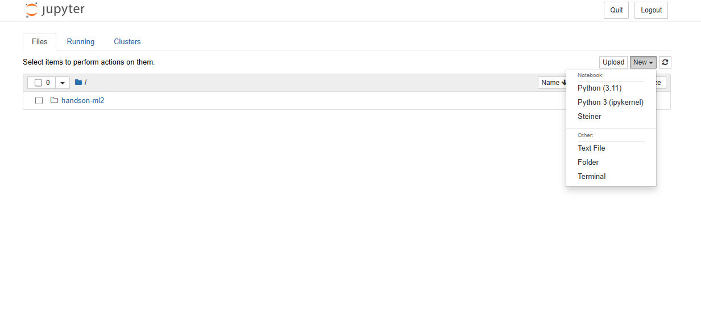
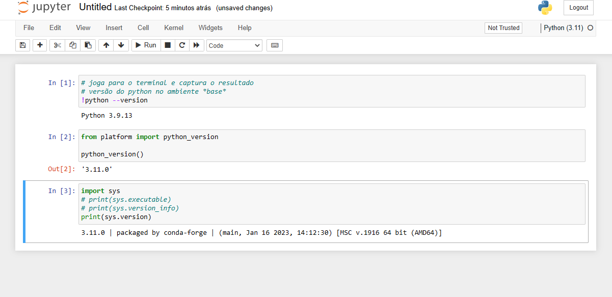

title: Registrando uma novo ambiente no Jupyter Notebook
date: 2023-01-28
slug: registrando-novo-kernel-jupyter
authors: Giliard Godoi
summary: Instale o *Jupyter Notebook* uma vez e rode diferentes ambientes nele registrando kernels.
category: programming-skills
tags: python, jupyter

No dia-a-dia, é comum criarmos ambientes diferentes para cada um dos nossos projeto, evitando possíveis conflitos entre versões de pacotes etc.
Quando se trata de análise de dados, muitas vezes também somos tentados a instalar o [*Jupyter Notebook*](https://jupyter.org/) em cada um desses novos ambientes.

Contudo, eu já me confrontei com uma situação em que eu tinha um ambiente para rodar simulações e um outro ambiente para analisar os dados dessas simulações.
No ambiente de simulações, eu estava desenvolvendo um [Algoritmo Genético](https://pt.wikipedia.org/wiki/Algoritmo_gen%C3%A9tico) (AG) com suas próprias dependências, que possívelmente seria aberto e distribuído depois.

Nesse cenário, não seria interessante abrir o código do meu AG com as 'dependências' dos pacotes que eu utilizei para fazer a análise de dados (i.e. `pandas`, `matplotlib` etc.).
Porém, existia algumas análises específicas em que eu queria demonstrar como os algoritmos de cruzamento em que eu estava trabalhando, funcionavam.
Então eu instalei eles, como se fossem um pacote, nesse ambiente em que eu estava fazendo a análise de dados.

Recentemente, eu passei por uma situação semelhante e então resolvi escrever esse post.

# Registrando um kernel para um ambiente

Vamos supor que eu criei um ambiente com a nova versão do Python 3.11 usando o `conda` (Eu gosto de usar o `conda` não me critique!)
```bash
conda create --name py311 python=3.11
conda activate py311
python --version ## Python 3.11.0
```

*Sim, o `conda` já disponibiliza essa versão do Python, mas como a atualização de pacotes do Anaconda demora mais do que [PyPi](https://pypi.org/) algumas coisas podem não funcionar muito bem. Prosseguindo...*

No nosso novo ambiente vamos instalar o `ipykernel`:

```shell
conda install pip       # opcional
conda install ipykernel # ou então pip install ipykernel
```

Na data de publicação desse artigo, a versão do `ipykernel` disponível no canal padrão do anaconda, não suporta a versão 3.11 do Python.
Uma saída é instalar via `pip` mesmo.

```shell
python -m pip install ipykernel
```

Agora vamos instalar, ou registrar, esse novo ambiente como um *Jupyter* kernel (supondo que estamos dentro do ambiente, no caso o `py311`, que desejamos registrar.)

```shell
# conda activate py311
# python -m pip install ipykernel
python -m ipykernel install --user --name py11 --display-name "Python (3.11)"
```

Pronto! Agora podemos sair do ambiente `py311` e voltar para o ambiente `base` onde o nosso *full Jupyter Notebook*  está instalado.
```shell
conda deactivate
```

# Criando um notebook com um kernel específico

Para criar um novo *notebook* basta selecionar o kernel desejado no menu *new*.



Para checar a versão do python do kernel selecionado podemos usar tando o `sys.version` quanto a função `python_version` do módulo `platform`.



É importante observar que, quando utilizamos o comando `!python --version` é como se esse comando fosse jogado para o terminal e recuperasse a versão do python do terminal, isto é, do terminal em que estamos rodando o ambiente `base`.

Então essa não é a versão do kernel que estamos ativando.

# Listando os Kernels disponíveis

Para listar os kernels disponíveis, utilize o seguinte comando:
```shell
jupyter kernelspec list
```

# Removendo um kernel

Segundo esse post [aqui](https://queirozf.com/entries/jupyter-kernels-how-to-add-change-remove) para remover um kernel basta utilizar o seguinte comando:
```
jupyter kernelspec remove <kernel-name>
```

Porém, eu não testei o que acontece se eu remover (desinstalar) o ambiente primeiro e depois remover o kernel, ou fazer o inverso.

# Referências

Ipython Documentation. *Installing the IPython kernel*. Disponível em: <https://ipython.readthedocs.io/en/stable/install/kernel_install.html>. Acessado em 28 de jan. de 2023.

Noopur R K. *How to add your Conda environment to your jupyter notebook in just 4 steps*. Disponível em: <https://medium.com/@nrk25693/how-to-add-your-conda-environment-to-your-jupyter-notebook-in-just-4-steps-abeab8b8d084>. Acessado em 28 de jan. de 2023.

Felipe Almeida. *Jupyter Notebook Kernels: How to Add, Change, Remove*. Disponível em <https://queirozf.com/entries/jupyter-kernels-how-to-add-change-remove>. Acessado em 28 de jan. de 2023.