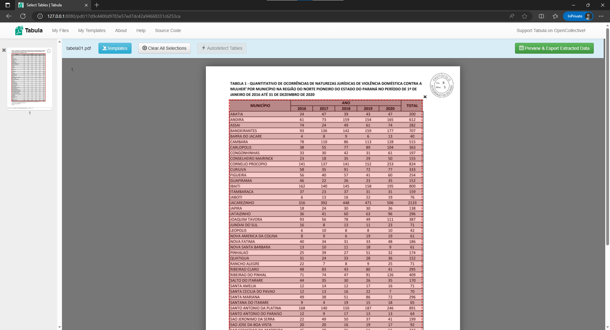

title: Extrair dados de arquivos PDFs
summary: Um exemplo de como extrair dados de tabelas em arquivos `pdf`, para análise dos casos de violência doméstica em Municípios do Norte Pioneiro Paranaense.
date: 2023-08-04
modified: 2023-04-07
slug: exemplo-tabula-analise-dados-violencia-domestica
authors: Giliard Godoi
category: data-analysis


No ano de 2020, a Câmara Municipal de Santo Antônio da Platina solicitou à Secretaria de Segurança Pública do Estado do Paraná dados sobre casos de violência doméstica e contra a mulher. 
O requerimento de solicitação está disponibilizado no site da entidade no [seguinte link](https://sapl.santoantoniodaplatina.pr.leg.br/materia/2613). 

O problema é que essas solicitações são respondidas em formatos de arquivos fechados, como arquivos em formado `pdf`, que impedem a leitura de dados por outros programas de computador.
E com isso impedem também a realização de outras análises.

O software [Tabula](https://tabula.technology/) é um extrator de tabelas de documentos em `PDF`. 
Com é possível extrair os dados das tabelas e exportar para arquivos abertos como arquivos com valores separados por vírgulas (csv - [Comma-Separated Values](https://pt.wikipedia.org/wiki/Comma-separated_values)). 

Esse é um programa feito em Java, então você vai precisar instalar o Java na sua máquina para executar o Tabula. As instruções para instalação podem ser encontradas na documentação do repositório da ferramenta, disponível nesse [endereço](https://github.com/tabulapdf/tabula?tab=readme-ov-file#using-tabula).

Após executar o programa, só precisa selecionar o arquivo em PDF e selecionar a área em que está a sua tabela.

<!--  -->


E então, o programa cuida do resto...

<!--  -->


Com os dados em um formato aberto, então é possível realizar a leitura com um código em Python, por exemplo, e realizar análises complementares e criar gráficos como o observados a seguir.

```python
import pandas as pd
import seaborn as sns
from matplotlib import pyplot as plt

anos = [f'20{x}' for x in range(16,21)]

df = pd.read_csv('tabela-03-dados.csv')

df = df.drop(columns=['TOTAL'])
df[anos] = df[anos].astype(int)

df2 = df.melt(
    id_vars=["MUNICÍPIO"],
    value_vars=anos,
    var_name="ANO",
    value_name='value')

select = (df2['MUNICÍPIO'] == "SANTO ANTONIO DA PLATINA") | (df2['MUNICÍPIO'] == "JACAREZINHO")

fig = plt.figure(figsize=(15,7))
g = sns.lineplot(data=df2[~select],
                 x="ANO",
                 y="value",
                 units="MUNICÍPIO",
                 estimator=None,
                 markers=True,
                 color=".7",
                 linewidth=1,
                 legend= False)

g4 = sns.lineplot(data=df2[select],
                  x="ANO",
                  y="value",
                  hue="MUNICÍPIO",
                  markers=True,
                  dashes=False,
                  legend=True)

sns.despine(right=True, left=True)
plt.ylabel("Quantidade")
plt.xlabel("Ano");
```

O gráfico a seguir apresenta a quantidade dos casos de violência doméstica, por natureza jurídica, nos municípios da região do Norte Pioneiro do Estado do Paraná, no período de 01/01/2016 a 31/12/2020.

<!--  -->


No eixo vertical (eixo Y) temos representado a quantidade de casos, enquanto que no eixo horizontal (eixo X) são representados os anos de 2016 à 2020.
Os municípios de Jacarezinho e Santo Antônio da Platina estão destacados, enquanto os demais municípios do Norte Pioneiro estão representados por linhas cinza-claro.

Com essa representação é possível observar que o município de Jacarezinho se destaca entre os demais. 
A razão para tanto, pode ser que este é o único município da região que possui uma Delegacia Especial da Mulher.

Nesse cenário, podemos levantar a hipótese se existe uma subnotificação dos casos de violência doméstica nos demais municípios que não contam com uma unidade especializada para atender a esses casos.

# Aviso

> As opiniões expressas nesse artigo são somente minhas, e não refletem necessáriamente a opinião de instituições ou pessoas eventualmente citadas nesse artigo.

# Referências

Câmara de Santo Antônio da Platina. **Requerimento nº 598 de 2020, de autoria da Vereadora Mirian Rodrigues Bonomo Montanheiro**. Disponível em: <https://sapl.santoantoniodaplatina.pr.leg.br/materia/2613>. Último acesso em 07 de abr. de 2024.
 
Tabula Oficial Webpage. <https://tabula.technology/>
