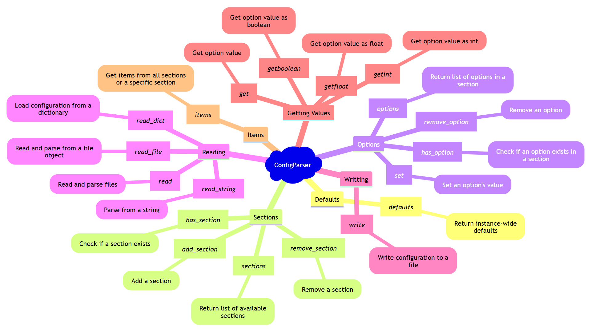

title: Um guia rápido para arquivos de configuração .ini com configparser
summary: Conheça as principais funções da biblioteca `configparser` para manipular arquivos `.ini` no Python.
date: 2024-05-26
modified: 2025-03-04
slug: guia-configparser-python
authors: Giliard Godoi
category: programming-skills
tags: config, toml, yaml



## Caracterísitcas dos arquivos `.ini`

A extensão `.ini` são um formato simples e amplamente utilizados para armazenar configurações de aplicativos. A especificação foi primeiramente projetada para os programas do [sistema Microsoft Windows](https://en.wikipedia.org/wiki/INI_file). Contudo, eles acabaram sendo adotados pela comunidade de softwares abertos, onde também podem aparecer sob a extensão `.cfg` -- embora possam ter alguns detalhes diferentes.

Um exemplo de arquivo `.ini` seria:
```ini
[DEFAULT]
email = meu@email.com
local = Brasil
profession = Student # isso é um comentário
major = Technology

[personal]
name = Giliard Godoi


[education]
school = Federal University of Technology - Paraná
major  = Computer Science
year   = 2018

[skills]
programming = Python, JavaScript, C, C++
languages   = Portuguese, English
```

As principais características desse formato são:

1. Estrutura de **chave-valor** organizada em **seções**.
2. Permitem **comentários** após o carater `#`.
3. Todos os valores são armazenados como **strings**, mas podem ser convertidos.
4. A seção `DEFAULT` apresenta valores defaults que podem ser acessados pelas demais seções.

No Python, a biblioteca padrão [`configparser`](https://docs.python.org/3/library/configparser.html) facilita a leitura e escrita desses arquivos.

Ao realizar o parse de um arquivo, é retornado um objeto semelhante a um dicionário do Python, porém com alguns métodos extras que serão apresentados a seguir.

## Configparser na prática

De forma geral, a biblioteca `configparser` disponibiliza as seguintes funcionalidades:

1. Realizar o parser de um arquivo `.ini` para um objeto do tipo `ConfigParser`.
2. Escrever um arquivo `.ini` a partir de um objeto `ConfigParser`.
3. Listar as seções e os seus atributos.
4. Verificar a existencia de uma seção e de um atributo.
5. Acessar os valores dos atributos.
6. Converter os valores dos atributos para tipos específicos de dados.


### Parse de um arquivo `.ini`

Para realizar o parse de um arquivo `.ini` primeiro instanciamos um objeto do tipo `ConfigParser`, e então passamos a localização, isto é, o arquivo para o método `.read`.

```python
import configparser

config = configparser.ConfigParser()
config.read('config.ini')

type( config ) # configparser.ConfigParser
```

Também é possível utilizar os seguintes métodos para popular os valores de um objeto `ConfigParser`:

- `read_file`: realiza o parser a partir de um objeto do tipo `file`
- `read_string`: a partir de uma string.
- `read_dict`: a partir de um objeto dict.

### Conheçendo as seções e atributos do objeto `ConfigParser`

Os atributos são organizados em seções que agrupam atributos. A lista de seções existentes é acessada pelo método `.sections`.

```python
>> config.sections()
['personal', 'education', 'skills']
```

Note que a seção `DEFAULT` não é listada. O seu propósito é guardar valores *defaults* para as demais seções.

Também é possível acessar uma seção por indexação, da mesma forma que fazemos com um dicionário do Python

```python
config['DEFAULT'] # <Section: DEFAULT>

config['personal'] # <Section: personal>
```

O método `.options` permite conheçer todos os atributos (ou opções) de uma seção específica.
```python
config.options('education')
  ['school', 'major', 'year', 'email', 'local', 'profession']
```

Note que todos os atributos da seção `DEFAULT` também são listados como atributos da seção `education`, mesmo que isso não faça muito sentido para o nosso exemplo.

O método `.items` retorna uma lista de tuplas com as chaves e valores de uma seção, da mesma forma que o método analogo do dicionário do Python.
```python
>> config.items('education')
  [('email', 'meu@email.com'),
    ('local', 'Brasil'),
    ('profession', 'Student # isso é um comentário'),
    ('major', 'Computer Science'),
    ('school', 'Federal University of Technology - Paraná'),
    ('year', '2018')]
```

Com isso é possível iterar sobre as chaves e dos valores de uma seção.
```python
for key, value in config.items('education'):
    print(f'{key}: {value}')
```

Porém se tentarmos utilizar o método `.options`  passando a seção `DEFAULT` é lançada uma exception `NoSectionError`. Porém, é possível conheçer os atributos e valores da seção  `DEFAULT` com o método `.items`, conforme visto anteriormente, ou utilizando o método `.defaults` que retorna um dicionário.
```python
config.defaults()
  {'email': 'meu@email.com',
  'local': 'Brasil',
  'profession': 'Student # isso é um comentário',
  'major': 'Technology'}
```

### Verificando a existência de seções e atributos

Ao passar a chave para uma seção inexistente no objeto `ConfigParser` é lançado uma exceção do tipo `KeyError`. Para verificar se uma seção existe no objeto, podemos fazer isso através do operador `in` ou do método `.has_section`.
```python
'education' in config
  True

config.has_section('education')
  True

config.has_section('certifications')
  False
```

Para verificar se um atributo existe dentro de uma seção utilizamos o método `.has_option` e passamos como parâmetro o nome da seção e do atributo que queremos verificar.
```python
config.has_option(section='education', option='year')
  True
```
Se o parâmetro para a seção for definido como `None` ou por string vazia, a seção default é verificada.
```python
config.has_option(section=None, option='email')
  True

config.has_option(section='', option='email')
  True
```

Lembre-se que se um atributo não existe dentro de uma seção, o valor presente em `DEFAULT` é retornado. Este comportamento também se repete ao verificar a existência de um atributo.
No exemplo a seguir, `email` não é explicitamente definido dentro da seção `education`.
```python
config.has_option(section='education', option='email')
  True
```

### Acessando valores dos atributos

A forma mais simples de acessar um valor de um objeto `ConfigParser` é por indexação.

```python
config['personal']['name']
  'Giliard Godoi'

config['education']['school']
  'Federal University of Technology - Paraná'

config['DEFAULT']['email']
  'meu@email.com'

# Acessando os valores de default
config['personal']['profession']
  'Student'
```

Os valores da seção default não são utilizados se os atributos forem explicitamente definidos em uma seção específica.
```python
config['education']['major']
  'Computer Science'
```

Também é possível acessar os valores de uma seção com o método `.get`.
```python
config.get(section='education', option='school')
  'Federal University of Technology - Paraná'
```

O método `.get` permite definir um valor de fallback, isto é, o 'default do default', caso uma seção ou um atributo não existam.
No exemplo a seguir a seção `company` não é definida para o nosso exemplo.
Ao utilizar o método `.get`, o valor de fallback é retornado.
```python
assert not config.has_option(section='company', option='name')
config.get(section='company', option='name', fallback='Does not exist')
  'Does not exist'
```

Como já foi mencionado, os valores dos arquivos `.ini` são armazenados como strings.
E por isso, os valores dos atributos são todos do tipo string.
```python
type(config['education']['year'] )
  str
```

### Converter valores para tipos específicos

No entanto é possível converter os valores para os tipos `int`, `float` e `bool` com os métodos `.getint`, `.getfloat` e `.getbool`, respectivamente.

```python
config.getint('education', 'year')
  2018
```

Se precisar armazenar listas, use separadores consistentes e o método `.split()` para recuperação.
```python
config['skills']['programming'].split(',')
  ['Python', 'JavaScript', 'C', 'C++']

```

### Salvando um arquivo `.ini`


```python
config['project'] = {'name': 'ConfigParser Guide', 'version': '1.0'}

with open('config.ini', 'w') as configfile:
    config.write(configfile)
```

## Dicas e boas práticas
- Sempre use `getint()`, `getfloat()`, ou `getboolean()` quando precisar de tipos específicos.
- Utilize `fallback=` no método `get()` para evitar erros ao acessar chaves inexistentes.
- Se precisar armazenar listas, use separadores consistentes e o método `.split()` para recuperação.


## Referências
1. [Documentação oficial do configparser](https://docs.python.org/3/library/configparser.html)
2. [INI file - Wikipedia](https://en.wikipedia.org/wiki/INI_file)

