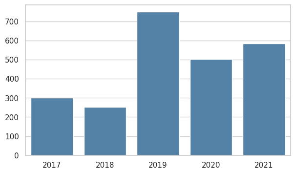
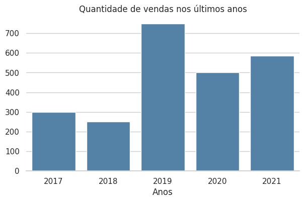
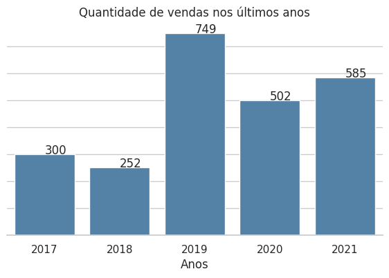
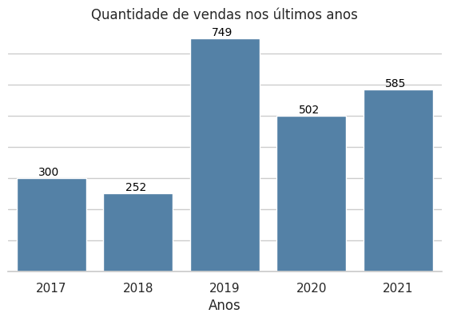
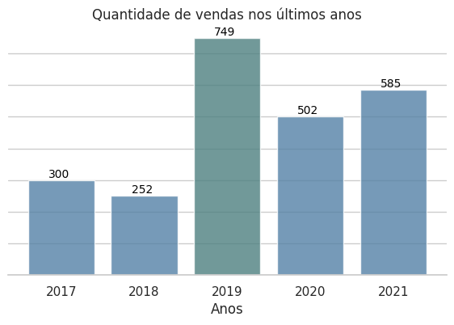

title: Gráfico de barras com rótulos customizados
summary: Tutorial para definir um gráfico de barras com rótulos customizados.
date: 2025-03-05
slug: grafico-barras-com-rotulos-customizados
authors: Giliard Godoi
category: data-visualization
tags: matplotlib, seaborn, tutorial

Neste tutorial vamos criar um gráfico de barras para as vendas de um produto A entre os anos de 2017 a 2021. A dificuldade aqui é alinhar o texto do valor da venda e a barra do gráfico para um determinado ano.

Apesar de ser uma tarefa simples, esse é um bom exemplo de como eu abordo a criação de uma visualização de dados, através de um desenvolvimento iterativo.

Nesse exemplo, nós vamos utilizar as bibliotecas `matplotlib` e `seaborn` com o estilo `whitegrid` definido.
```python
from matplotlib import pyplot as plt
import seaborn as sns

sns.set_theme(style="whitegrid")
```

Como exemplo, nós vamos analisar os dados de vendas entre os anos de 2017 a 2021 de um produto A.
```python
anos = [ 2017, 2018, 2019, 2020, 2021 ]

vendas = [ 300, 252, 749, 502, 585]
```

O primeiro passo é utilizar as funções presentes nas bibliotecas `matplotlib` e `seaborn` para obter o gráfico padrão, sem muitas customizações.
```python
# definimos as dimensões da figura
plt.figure(figsize=(7, 4))

# comando para criar o gráfico
ax = sns.barplot(x=anos, y=vendas, color='steelblue')
```


Nesse gráfico os anos são representados no eixo X, enquanto os valores de vendas são apresentados no eixo Y. Foi definida a cor padrão *steelblue* para todas as barras. O tamanho do gráfico, e a proporção entre a largura e altura, foi definida como `(7,4)`

Desse gráfico básico, o que podemos querer melhorar nele? Por exemplo, alguns pontos seriam:

1. Inserir um título informativo no gráfico.
2. Adicionar um rótulo descritivo no eixo X ou Y.
3. Remover elementos desnecessários para obter uma figura mais limpa.
4. Talvez transformar os valores do eixo Y em rótulos das colunas para cada anos.

A inserção do título e de um rótulo do eixo X é simples e pode ser feito através das funções `plt.title()` e `plt.xlabel()` da biblioteca `matplotlib`. Não há segredo nisso.
```python
plt.figure(figsize=(7, 4))
ax = sns.barplot(x=anos, y=vendas, color='steelblue')

# Adicionando o título
plt.title("Quantidade de vendas nos últimos anos", fontsize=12)

# Adicionando o label para o eixo X
plt.xlabel('Anos')
```


Para eliminar a borda dos gráficos, podemos utilizar a função `.despine` disponibilizado pela biblioteca `seaborn`.
```python
plt.figure(figsize=(7, 4))
ax = sns.barplot(x=anos, y=vendas, color='steelblue')

plt.title("Quantidade de vendas nos últimos anos", fontsize=12)
plt.xlabel('Anos')

# remove o cortorno dos eixos.
sns.despine(left=True)
```


O gráfico já parece muito bom assim. Já é possível comparar os valores das vendas entre um ano e outro.
Porém, vamos ver como o gráfico fica se retirarmos os valores que aparecem no eixo Y (ticks) talvez colocar o rótulo nesse eixo, e fixar os valores do intervalo que são mostrados.

Fixar o intervalo do eixo Y é necessário para garantir que os rótulos que apareçam sob as barras não sejam truncados, isto é, sejam posicionados fora dos limites considerados pelo eixo Y.
```python
plt.figure(figsize=(7, 4))
ax = sns.barplot(x=anos, y=vendas, color='steelblue')

plt.title("Quantidade de vendas nos últimos anos", fontsize=12)
plt.xlabel('Anos')

sns.despine(left=True)

# remove os valores do eixo Y 0, 100, 200 etc.
ax.set(yticklabels=[])

# Insere o rótulo vendas no eixo Y
plt.ylabel('Vendas')

# Fixa o range considerado para o eixo y isto é, de 0 até 790
plt.ylim((0, 790))
```


Talvez o rótulo no eixo Y não seja tão necessário assim, uma vez que o título do gráfico já é bem descritivo.

Para posicionar os rótulos acima de cada barra, vamos percorrer os objetos que definem essas barras, os objetos `patches` para obter as coordenadas de início da barra (`p.get_x`) a sua largura (`p.get_width`) e altura (`p.get_height`). Os rótulos serão criados a partir do método `ax.annotate` do objeto `Axes` que representa o nosso gráfico.
```python
plt.figure(figsize=(7, 4))
ax = sns.barplot(x=anos, y=vendas, color='steelblue')

plt.title("Quantidade de vendas nos últimos anos", fontsize=12)
plt.xlabel('Anos')

sns.despine(left=True)

ax.set(yticklabels=[])
plt.ylim((0, 790))

# percorre os patches que definem as barras
for p in ax.patches:
  ax.annotate("%.0f" % p.get_height(), # texto a ser impresso
                # coordenadas (X, Y) do texto
               (p.get_x() + p.get_width() / 2., p.get_height())
             )
```


Note que os rótulos ficaram ligeiramente deslocados em relação a barra. Para corrigir isso é necessário informar alguns parâmetros adicionais no método `ax.annotate` como alinhamento horizontal, alinhamento vertical e deslocamentos adicionais.
```python
plt.figure(figsize=(7, 4))
ax = sns.barplot(x=anos, y=vendas, color='steelblue')

plt.title("Quantidade de vendas nos últimos anos", fontsize=12)
plt.xlabel('Anos')

sns.despine(left=True)

ax.set(yticklabels=[])
plt.ylim((0, 790))


for bar in ax.patches:
  ax.annotate("%.0f" % bar.get_height(), # texto
                # coordenada xy
                (bar.get_x() + bar.get_width() / 2., bar.get_height() ),
                # Define o alinhamento horizontal e vertical do texto
                ha='center', va='center',
                # Tamanho e cor da fonte
                fontsize=10,
                color='black',
                # Deslocamento adicional
                xytext=(-2, 5),
                textcoords='offset points'
            )
```

Os parâmetros `ha` e `va` definem o alinhamento do conteúdo da caixa de texto. Já `xytext` e `textcoords` controlam o posicionamento da caixa de texto em relação à coordenada anotada (xy).

- `textcoords` define o sistema de coordenadas para interpretar xytext. Por exemplo, `'offset points'` define que o deslocamento é dados em pontos tipográficos (1/72 de polegada).
- `xytext` define um deslocamento adicional em relação a (xy). Esse deslocamento pode ser um par de valores `(dx, dy)`, indicando quantos pontos ou unidades a anotação será movida.

O valor `xytext = (-2, 5)` indica que o texto será movido 5 pontos tipográficos para cima e 2 pontos tipográficos à esquerda, ajustando o posicionamento do rótulo.

Os resultados dessas modificações são apresentados na figura a seguir.



## Extras

Como estamos percorrendo os objetos que definem as barras do nosso gráfico, é possível alterar as propriedades dessa colunas. Por exemplo, no código abaixo estamos alterando a transparência das barras e alterando a cor da barra que representa o maior valor de vendas.

Além disso, a chamada ao método `ax.axis("tight")` faz com que o `matplotlib` recalcule certos parâmetros para melhorar os ajustes do gráfico ao tamanho da figura.

```python
plt.figure(figsize=(7, 4))
ax = sns.barplot(x=anos, y=vendas, color='steelblue')

plt.title("Quantidade de vendas nos últimos anos", fontsize=12)
plt.xlabel('Anos')

sns.despine(left=True)

ax.set(yticklabels=[])
plt.ylim((0, 790))


for bar in ax.patches:
    # Alterando a cor
    if bar.get_height() == max(vendas) :
        bar.set_facecolor([0.3, 0.5, 0.5])
    # Alterando a transparência
    bar.set_alpha(0.8)

    ax.annotate("%.0f" % bar.get_height(),
                    (bar.get_x() + bar.get_width() / 2., bar.get_height() ),
                    ha='center', va='center',
                    fontsize=10,
                    color='black',
                    xytext=(-2, 5),
                    textcoords='offset points'
                )

_ = ax.axis("tight")
```



## Referências

Matheus Budkewicz. **Gráficos de barra com matplotlib**. Disponível em <https://medium.com/horadecodar/gr%C3%A1ficos-de-barra-com-matplotlib-85628bfc4351> Acessado em: 21 de fev. de 2025.

Matplotlib. **matplotlib.pyplot.annotate**. <https://matplotlib.org/stable/api/_as_gen/matplotlib.pyplot.annotate.html> Acessado em: 21 de fev. de 2025.

Matplotlib. **matplotlib.patches.Patch**. Disponível em: <https://matplotlib.org/stable/api/_as_gen/matplotlib.patches.Patch.html> Acessado em: 21 de fev. de 2025.