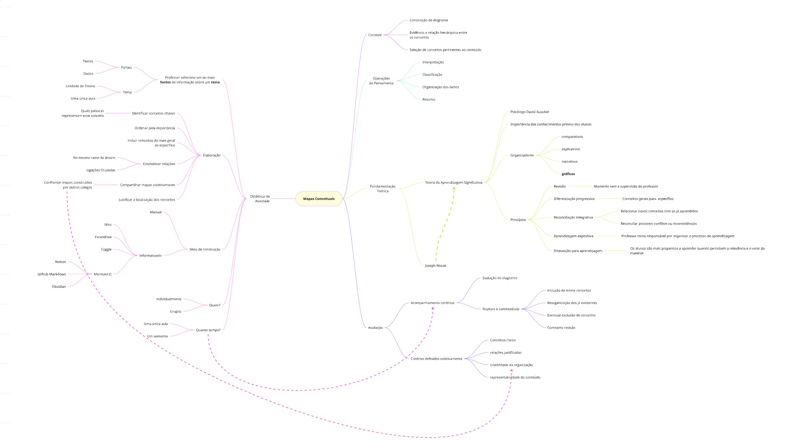
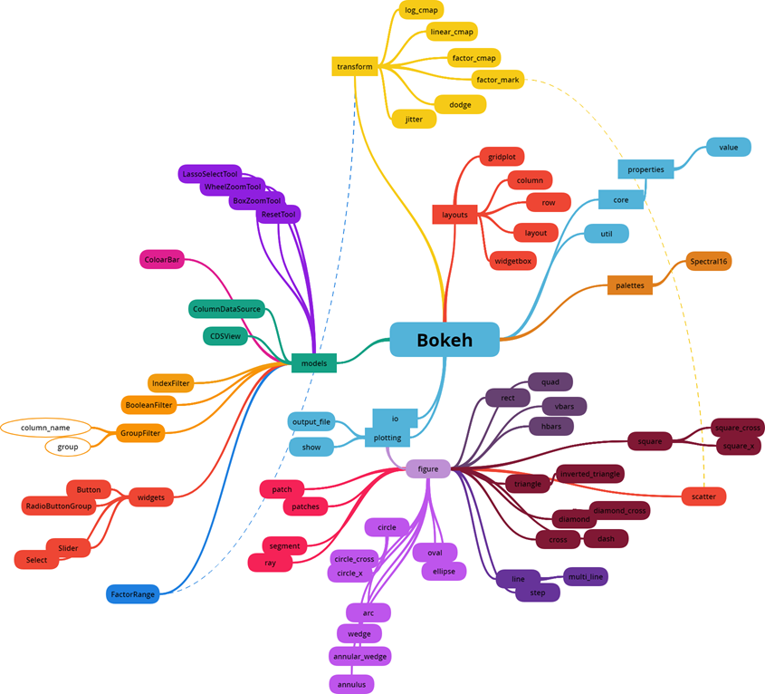
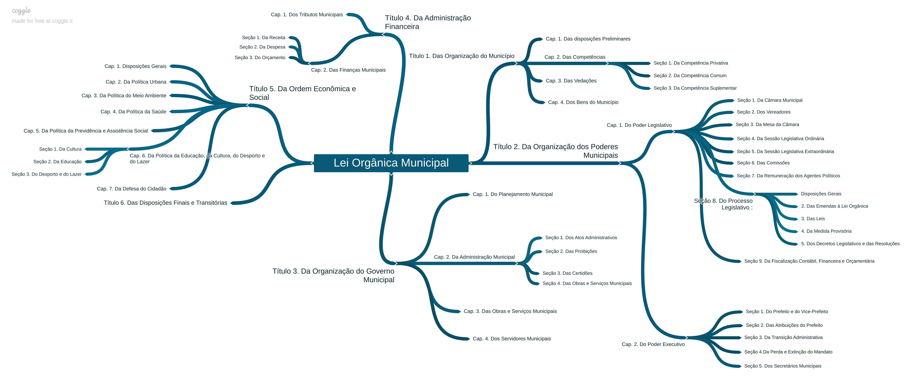

title: O que são mapas mentais e conceituais?
summary: Sobre mapas mentais e conceituais como ferramenta visual para organização de informações e revisão de conteúdos estudados.
authors: Giliard Godoi
date: 2025-03-22
slug: o-que-sao-mapas-conceituais
category: educação
tags: diagramas, mapas-conceituais, mapas-mentais, aprendizagem, estudo

Mapas mentais são diagramas que resumem as ideias e conceitos sobre um tema. Eles são uma ferramenta muito útil para organizar informações, e para revisar um assunto estudado. Um mapa mental apresenta a ideia principal no centro do diagrama, a partir do qual os conceitos relacionados se expandem. E, a partir desses conceitos, outros conceitos relacionados podem ser adicionados. Desta forma, um mapa mental organiza a informação de maneira hierárquica, em uma estrutura remete a uma [árvore em Teoria dos Grafos](https://pt.wikipedia.org/wiki/%C3%81rvore_(grafo)). Relações transversais entre os ramos podem ser representadas por linhas que conectam os conceitos. Essas linhas podem ser direcionadas, e podem conter verbos que detalham a relação entre os conceitos adjacentes.

De forma semelhante, os [mapas conceituais](https://pt.wikipedia.org/wiki/Mapa_conceitual) são diagramas que representam graficamente as relações entre as ideias pertinentes a um tema. Porém, os mapas conceituais são mais complexos que os mapas mentais, e podem conter vários conceitos principais que se inter-relacionam. Além disso, as relações entre os conceitos podem ser organizadas de maneira mais livre.

A concepção desses diagramas fundamentam se na [Teoria da Aprendizagem Significativa](https://ensinarhistoria.com.br/teoria-da-aprendizagem-significativa-de-david-ausubel/), criada pelo psicólogo norte-americano David Ausubel. Segundo essa teoria, a aprendizagem ocorre quando o conhecimento novo se relaciona com o conhecimento prévio do aluno. Ou seja, o professor deve apresentar o conteúdo relacionando-o com aquilo que os alunos já sabem. Para tanto, Ausubel propõe o conceito de organizadores prévios, que são estratégias de apresentar o conteúdo relacionando-os com o conhecimento prévio do aluno. Esses organizadores poedem ser comparativos, expositivos, narrativos, e gráficos. Os mapas conceituais são um exemplo de organizadores gráficos.

Os organizadores gráficos são qualquer tipo de diagramas capazes de sintetizar algum tipo de conhecimento ou informação. Os mapas conceituais (ou mentais) são um tipo de organizador gráfico que organiza o conhecimento em torno de conceitos chaves, e as relações entre esses conceitos. Outros organizadores gráficos são diagramas de Venn, tabelas, linhas de tempo, e fluxogramas.

Anastasiou e Alves (2007) argumentam que os mapas mentais e conceituais são um importante recurso didático que podem ser utilizados para facilitar a aprendizagem. Ou seja, os mapas não são apenas uma ferramenta de estudo individual para o aluno, mas também uma ferramenta de mediação e comunicação de ideias entre aluno, professor, e outros alunos. A [Figura 1](#fig-01) a seguir apresenta um mapa mental sobre a definição de mapa conceitual a partir da leitura dessas autoras.

<figure id="fig-01">
    
    <figcaption align="center">
        <em>Figura 01. Representação do conceito de mapa mental a partir de Anastasiou e Alves (2007). Clique na imagem para ampliar</em>
    </figcaption>
</figure>

Construir um mapa mental é uma maneira de mobilizar e resignificar o conhecimento adquirido. A aprendizagem ocorre por meio da interação do estudante com o conteúdo (ou tema) através de um livro texto, vídeos, aulas expositivas, palestras e ou outros materiais. E toda interação é uma fonte de geradora de sentido para o aluno, isto é, ele está constantemente atribuíndo um sentido para as suas vivências. A construção de mapas mentais é uma maneira de organizar as impressões internas e identificar lacunas nos sentidos atribuídos durante as suas interações. Além disso, o mapa mental funciona como uma ferramenta de revisão, fornecendo pistas e 'gatilhos' visuais para relembrar o conteúdo estudado e a relação entre os conceitos.

Pessoalmente eu gosto de utilizar mapas mentais para sintetizar comandos e parâmetros de bibliotecas de programação. Um exemplo de um mapa mental pode ser visto nessa [postagem](https://giliardgodoi.github.io/articles/2024/guia-configparser-python/) sobre a biblioteca configparser. A figura a seguir, apresenta um mental sobre as principais funções da biblioteca de visualização de dados [Bokeh](https://bokeh.org/).

<figure id="fig-02">
    
    <figcaption align="center">
        <em>Figura 02. Representação dos comandos da biblioteca Bokeh. Clique na imagem para ampliar</em>
    </figcaption>
</figure>

Algumas ferramentas que eu utilizo ou já utilizei para construir mapas mentais são:

1.  [MermaidJS](https://mermaid.js.org) é uma biblioteca JavaScript para construir diagramas a partir de uma especificação escrita em texto. Essa ferramenta pode ser testada a partir deste [editor online](https://mermaid.live/). Para diagramas pequenos é uma ferramenta bem interessante. No caso dos mapas mentais, é possível visualizar a transformação dos *bullet points* em um diagrama, e como a informação é organizada de maneira hierárquica. A desvantagem é que não é possível (ainda) editar a posição dos conceitos. Além disso, para diagramas maiores, a usabilidade pode ser um pouco prejudicada. Além disso, ferramentas como o Notion e Obsidian oferecem suporte para a sintaxe do MermaidJS, possibilitando a criação de diagramas diretamente no editor textual das notas.
2.  [GoConqr](https://www.goconqr.com/) possui a intenção de ser um ambiente de aprendizagem para estudantes e concurseiros. Ele disponibiliza diversas ferramentas para estudo, incluindo a construção de mapas mentais. O mapa mental da [Figura 2](#fig-02) sobre a biblioteca Bokeh foi construído nessa ferramenta. Porém, pelo menos na versão gratuita, a usabilidade é bem ruim e o site é cheio de propagandas.
3.  [Coggle.it](http://Coggle.it) é outra ferramenta online para construir mapas mentais. A [Figura 3](#fig:mapa-organizacao-lei-organica), é uma mapa mental construído utilizando essa ferramenta, que ilustra a organização dos capítulos da [Lei Orgânica do Município](https://leismunicipais.com.br/lei-organica-santo-antonio-da-platina-pr) de Santo Antônio da Platina (PR).
4.  [Excalidraw](https://excalidraw.com/) é uma ferramenta online para construir diagramas. Ela não específica para construir mapas mentais, mas é possível construir mapas mentais utilizando os recursos disponíveis.
5.  [Miro.com](http://Miro.com) é uma ferramenta online para construir diagramas. A versão *pro* possui diversas funcionalidades interessantes, como a possibilidade de incluir colaboradores, utilização de IA generativa, e diversos recursos visuais. A versão gratuita permite criar até três projetos, o que é um pouco frustrante. Mas a usabilidade é bem melhor que as outras ferramentas. Outra desvantagem da versão gratuída é o limite na resolução da imagem exportada -- essa é uma razão para a Figura 01 não estar em alta resolução.

<figure id="fig:mapa-organizacao-lei-organica">
    
    <figcaption align="center">
        <em>Figura 03. Mapa mental sobre a organização dos capítulos da Lei Orgânica do Município de Santo Antônio da Platina (PR). Clique para ampliar.</em>
    </figcaption>
</figure>

Esta postagem foi motivada por uma resenha do texto de Anastasiou e Alves (2007) feita para a disciplina SMA5839 Preparação Pedagógica, oferecida no Programa de Pós-graduação em Ciência da Computação e Matemática Computacional, do ICMC. Uma cópia da resenha está disponível pelo seguinte link: [resenha_mapas_conceituais.pdf]({static}/pdfs/resenha_mapas_conceituais.pdf)

## Referências

Anastasiou, L. G. C., & Alves, L. P. (2007). **Processos de ensinagem na universidade: pressupostos para as estratégias de trabalho em aula**. Joinville: Univille.

**Mapa conceitual**, Wikipedia. Disponível em: [https://pt.wikipedia.org/wiki/Mapa\_conceitual](https://pt.wikipedia.org/wiki/Mapa_conceitual).

**Teoria da Aprendizagem Significativa de David Ausubel**, Ensinar História. Disponível em: [https://ensinarhistoria.com.br/teoria-da-aprendizagem-significativa-de-david-ausubel/](https://ensinarhistoria.com.br/teoria-da-aprendizagem-significativa-de-david-ausubel/).

**Mapa mental**, Wikipedia. Disponível em: [https://pt.wikipedia.org/wiki/Mapa\_mental](https://pt.wikipedia.org/wiki/Mapa_mental).

**Um guia rápido para arquivos de configuração .ini com `configparser`**. Disponível em: [https://giliardgodoi.github.io/articles/2024/guia-configparser-python/](https://giliardgodoi.github.io/articles/2024/guia-configparser-python/).

**MermaidJS Documentation**, MermaidJS. Disponível em: [https://mermaid.js.org](https://mermaid.js.org).

**Bokeh: data visualization**, Bokeh. Disponível em: [https://bokeh.org/](https://bokeh.org/).

**Mermaid Live Editor**, MermaidJS. Disponível em: [https://mermaid.live/](https://mermaid.live/).

**GoConqr**, Disponível em: [https://www.goconqr.com/](https://www.goconqr.com/).

**Coggle**, Disponível em: [http://Coggle.it](http://Coggle.it).

**Excalidraw**, Disponível em: [https://excalidraw.com/](https://excalidraw.com/).

**Miro**, Disponível em: [http://Miro.com](http://Miro.com).

