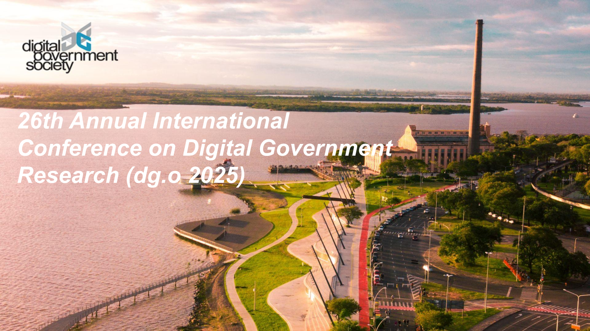

title: DGO 2025: tecnologia, pessoas e propósito
summary: Congresso Internacional em Governo Digital, reuniu pesquisadores de diferentes países em Porto Alegre, RS
authors: Giliard Godoi
date: 2025-06-20
slug: digital-governement-research-conference
category: presentations
tags: digital governement

<figure id="fig-01">
    
    <figcaption align="center">
        <em>Vista da Orla do Guaíba e Usina do Gasômetro. Porto Alegre, Rio Grande do Sul</em>
    </figcaption>
</figure>

Participar pela primeira vez do [Annual International Conference on Digital Government Research (DGO 2025\)](https://dgsociety.org/dgo-2025/) foi uma experiência verdadeiramente marcante. O evento aconteceu entre os dias 09 e 12 de junho, em Porto Alegre (RS) com todo um significado especial por ser a primeira edição realizada na América do Sul.

Ao falarmos sobre os recentes avanços tecnológicos, é comum que sentimentos ambíguos surjam. Primeiro, o encantamento diante das novas possibilidades; depois, as preocupações sobre os riscos e impactos negativos. As redes sociais são um exemplo disso: se por um lado essas redes aproximam pessoas distantes, por outro elas se tornaram terreno fértil para a disseminação de desinformação e notícias falsas (*fake news*).

O mesmo vale para as tecnologias de Inteligência Artificial Generativa. Essas IAs, capazes de imitar a escrita e o raciocínio humano ou gerar imagens impressionantes, expandem nossa criatividade, mas também agravam o problema da desinformação, levantando dúvidas sobre nossa capacidade de distinguir o que é real do que é artificial.

Nesse cenário de entusiasmo e apreensão, o DGO 2025 se consolida como um espaço de diálogo essencial. Reunindo pesquisadores, estudantes, agentes públicos e profissionais de diversas áreas, o evento promove reflexões sobre como utilizar as tecnologias emergentes para o bem da sociedade, com foco em justiça, equidade e transparência.

Tecnologias, por si só, não são boas nem ruins. Elas são ferramentas cujo impacto depende das escolhas que fazemos, como indivíduos e como sociedade. Governos podem empregar essas ferramentas para o bem social, seja para oferecer melhores serviços aos cidadãos, agilizar processos internos, prevenir e conter desastres climáticos ou atender a população em situações críticas.

É por isso que encontros como o DGO são tão relevantes. Eles nos permitem conhecer pessoas de diferentes países que compartilham um objetivo comum: usar a tecnologia para o bem coletivo. Além disso, proporcionam o entendimento de que muitos dos desafios que enfrentamos localmente também se manifestam em outras partes do mundo, o que abre espaço para o intercâmbio de experiências e soluções.

Embora a tecnologia ocupa um papel central em nossas vidas, participar de um evento presencial reforça a importância do contato humano. Gestos simples de gentileza e empatia, como um aperto de mão ou um tímido "Olá, tudo bem? De onde você veio?", criam conexões que os meios digitais apenas complementam, mas não substituem.

Outro aspecto que me chamou a atenção foi a interdisciplinaridade do DGO. Com formação em computação, tive a oportunidade de trocar experiências com sociólogos, economistas e gestores públicos, o que ampliou minha visão sobre o uso social das tecnologias.

No meu caso específico, apresentei um artigo sobre a classificação de documentos jurídicos, abordando como melhorias nas etapas de pré-processamento textual podem impactar a qualidade da classificação por temas. Porém, as conversas com outros participantes me levaram a refletir além da parte computacional: como o Poder Judiciário utiliza essas ferramentas para automatizar e acelerar seus processos e quais são as implicações quando uma classificação automática erra.

A programação do DGO 2025 foi intensa. Já no primeiro dia, participei de workshops que abordaram questões como acessibilidade, equidade e segurança dos dados no Cadastro Único, que reúne informações das famílias beneficiárias de programas sociais do governo brasileiro. Durante as dinâmicas, o meu grupo discutiu sobre os desafios de interoperabilidade e o uso seguro desses dados na formulação de políticas públicas. Enquanto outros grupos enriqueceram a discussão com outras perspectivas igualmente importantes.

No período da tarde, participei de outro workshop sobre a criação de um programa de capacitação em Smart Cities e cidades resilientes. Foi inspirador ver como diferentes perspectivas se complementam para a construção de uma proposta coletiva. Mesmo tímido, senti a necessidade de contribuir com minhas ideias.

As sessões plenárias também foram enriquecedoras. Tivemos apresentações de representantes do governo federal brasileiro, que falaram sobre iniciativas de digitalização de serviços públicos e integração de dados. Conhecemos ainda experiências do governo chileno na oferta de serviços digitais e do governo gaúcho no uso da tecnologia para acelerar a ajuda financeira a vítimas das enchentes recentes.

Além das palestras e apresentações de artigos, as conversas nos intervalos e durante os almoços renderam diálogos inesperados e valiosos. Esses encontros inesperados nos colocam em contato com pesquisadores experientes, estudantes de pós-graduação ou que estão apenas começando.

Foi uma semana de aprendizados intensos, trocas enriquecedoras e crescimento profissional. Saio do DGO 2025 com o desejo de levar esse entusiasmo para projetos futuros e, quem sabe, fazer a nossa contribuição para o bem social.

---

## Veja também

Link para o meu artigo:

GODOI, G. A.; RIVOLLI, A.; LOPES FREIRE, D.; SOUZA FERNANDES PEREIRA, F.; REGINA VENTURA, N.; MARINO GONÇALVES DE ALMEIDA, A.; PAULO FAINA GARCIA, L.; DE SOUZA DIAS, M.; CARLOS PONCE DE LEON FERREIRA DE CARVALHO, A. Assessing rule-based document segmentation and word normalization for legal ruling classification. **Conference on Digital Government Research**, [S. l.], v. 1, 2025. DOI: 10.59490/dgo.2025.948. Disponível em: [https://proceedings.open.tudelft.nl/DGO2025/article/view/948](https://proceedings.open.tudelft.nl/DGO2025/article/view/948). Acesso em: 18 jun. 2025.

Link para a [apresentação de slides](https://drive.google.com/file/d/1k0cGEVbp7-lRoRDHGeVqFN0sSuJc5Jfq/view?usp=sharing)